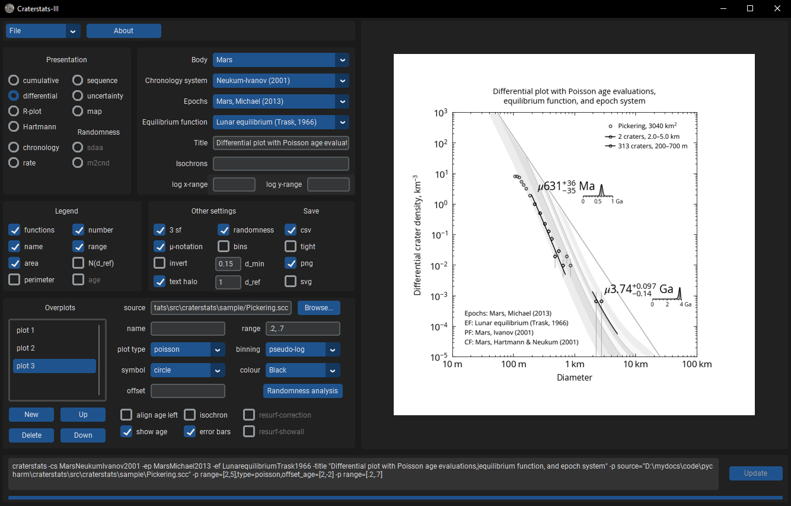

# Craterstats-III GUI

This is a graphical user interface wrapper for the [craterstats](https://github.com/ggmichael/craterstats) package. 
It is a self-contained application needing no other software installation. 
Executables can be downloaded [here](https://github.com/ggmichael/craterstatsGUI/releases).

Your system will warn that executables from unknown sources can be a security risk and ask you to confirm that you want
to allow craterstatsGUI to run. MacOS users may also require the following step: 

1. From a Terminal, run the command: 
`xattr -dr com.apple.quarantine <location of craterstatsGUI directory>`

   This allows the system to run the code without giving warnings about an "unidentified developer"

Double-click the executable to launch the GUI, or call with parameters from console for command-line mode.

The plot files used to generate [Gallery](https://github.com/ggmichael/craterstats/blob/main/docs/gallery.md) images 
can be found in the `demo/` folder of the installation.

### GUI tips

- Set the diameter range for the current overplot using a mouse click-drag in the plot window
- Adjust the position offset of an age label using a mouse shift-click-drag in the plot window

### Bug reports

Please open a GitHub [issue](https://github.com/ggmichael/craterstatsGUI/issues) if you have an account; alternatively, contact the author by email. 
It may be helpful to provide craterstatsGUI.log from the program folder. 
